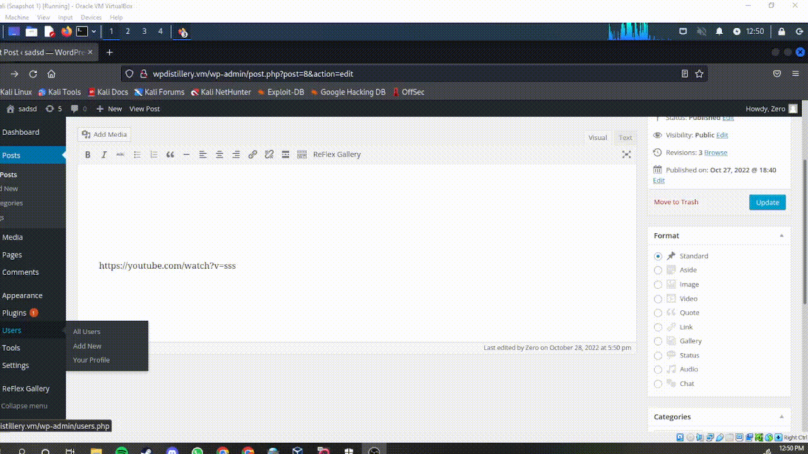

## Unit 7 & 8 Project: WordPress vs. Kali

**Homework Instructions**:

Time spent: **48** hours spent in total

> Objective: Find, analyze, recreate, and document **five vulnerabilities** affecting an old version of WordPres

### 1. (Required) Youtube Embedded Cross-Site Scripting

- [ ] Summary: 
- Vulnerability types: XSS
- Tested in version: 4.2
- Fixed in version: 4.7.3
- [ ] GIF Walkthrough: 
- [ ] Steps to recreate: 
- Create a post with the following text: [embed src='http://www.youtube.com/embed/sss\x3csvg onload=alert(1)\x3e'][/embed]
- [ ] Affected source code:
  - [Link 1](https://core.trac.wordpress.org/browser/tags/version/src/source_file.php)
  
### 2. (Required) Comment Cross-Site Scripting

- [ ] Summary: 
- Vulnerability types: XSS
- Tested in version: 4.2
- Fixed in version: 4.7.3
- [ ] GIF Walkthrough: 
- [ ] Steps to recreate: 
- Paste the following text in a comment: ****
- Make sure the character length is 64kb or more.
- [ ] Affected source code:
  - [Link 1](https://core.trac.wordpress.org/browser/tags/version/src/source_file.php)

### 3. (Required) User Enumeration

- [ ] Summary: 
Vulnerability types: XSS
Tested in version: 4.2
Fixed in version: 4.7.3 
- [ ] GIF Walkthrough: 
- [ ] Steps to recreate: 
- Paste the following code to kali-linux terminal: wpscan --url wpdistillery.vm --enumerate u
- [ ] Affected source code:
  - [Link 1](https://core.trac.wordpress.org/browser/tags/version/src/source_file.php)
